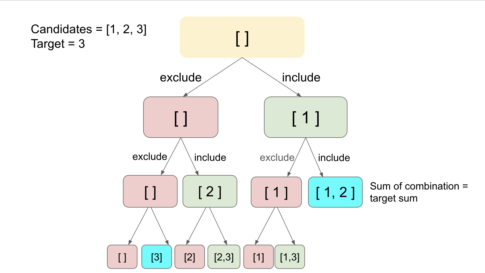

https://leetcode.com/problems/combination-sum-ii/editorial/#solution

***Solution***<hr />
***Overview***<br>
This is one of the problems in the series of combination sums. All these problems can be solved with the same backtracking algorithm.

We recommend trying these similar problems before tackling this one: Combination Sum and Combination Sum III, which are arguably easier and one can tweak the solution a bit to solve this problem.

We also listed some follow-up problems at the end of the article if you are interested in exploring the bactracking algorithm further.

***Approach: Backtracking*** <br>
***Intuition***<br>
In this problem, we need to generate unique combinations with the given sum value. In the worst case, we might need to generate the sum of all combinations in the array. Backtracking can be effectively used to generate all the possible combinations recursively. Backtracking incrementally builds candidates to the solutions and abandons a candidate (backtracks) as soon as it determines that this candidate can't lead to a final solution. For example, in the given problem, we can discard the candidate solution when it exceeds the sum value, provided the array contains non-negative values. Refer to this backtracking explore card to read more about backtracking.

Using backtracking, we could incrementally build the combinations. When we find the current combination is not valid, we backtrack and try another option. For the first option, we add the current array element to the current combination array and move this combination to the next index recursively. Similarly, for the second option, we remove the element from the current combination array and move this combination to the next index. Therefore, for every index, we explored two possibilities of including and excluding that value and calculated the combination sum of the maintained combination array. If the desired sum is reached, we can append the list to the answer list. To demonstrate the idea, we showcase how it works with a concrete example in the following tree:



Are there any optimizations to reduce the backtracking calls? Since we need to return unique combinations, we can group equal values of the array together. The simplest way to group all elements together is by sorting them. Now, suppose the frequency of an element is freq, and you need to make backtracking calls for all its possible frequencies between 0 and freq, then we can simply pick them from the beginning of its group in the sorted array.

Algorithm
Main function - combinationSum2(candidates, target)

1. Initialize an array of lists ```list``` to store the combinations.
2. Sort the ```candidates``` in non-decreasing order.
3. Make a call to ```backtrack(list, tempList, candidates, totalLeft, index).```
4. Return ```list```.<br>

```backtrack(answer, tempList, candidates, totalLeft, index)```

1. If ```totalLeft``` is less than 0:
Return.
2. If ```totalLeft``` is 0:
    - Add the current combination to ```answer```.
3. Otherwise, iterate ```i``` from ```index``` to the end of ```candidates``` when ```totalLeft >= candidates[i]```:<br><br>
    - If i>index and candidates[i] is equal to candidates[i-1]:
Continue to the next iteration.
    - Add ```candidates[i]``` to ```tempList```.
    - Make a recursive call to ```backtrack(answer, tempList, candidates, totalLeft-candidates[i], i+1)```.
    - Remove the last added element from ```tempList```.


    https://youtu.be/rSA3t6BDDwg?si=13F3Zf5Cgp_CCyA0
    https://youtu.be/j9_qWJClp64?si=atPs0zrtsncyQ6IX